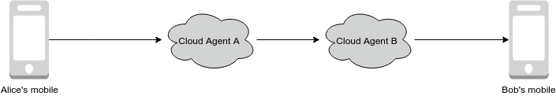
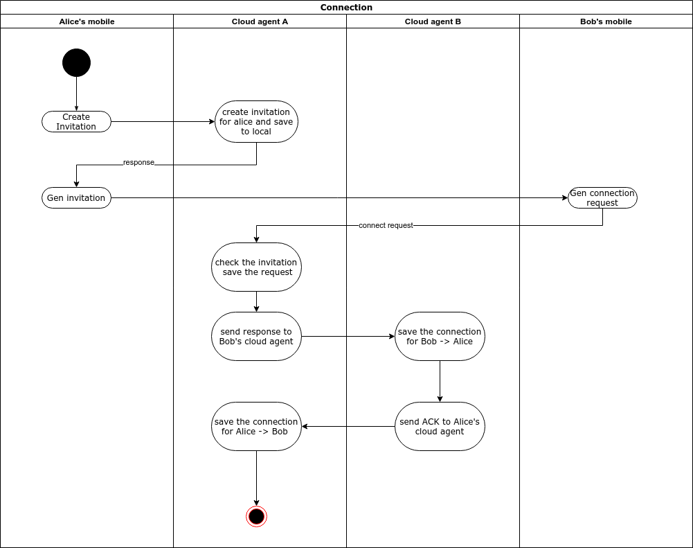
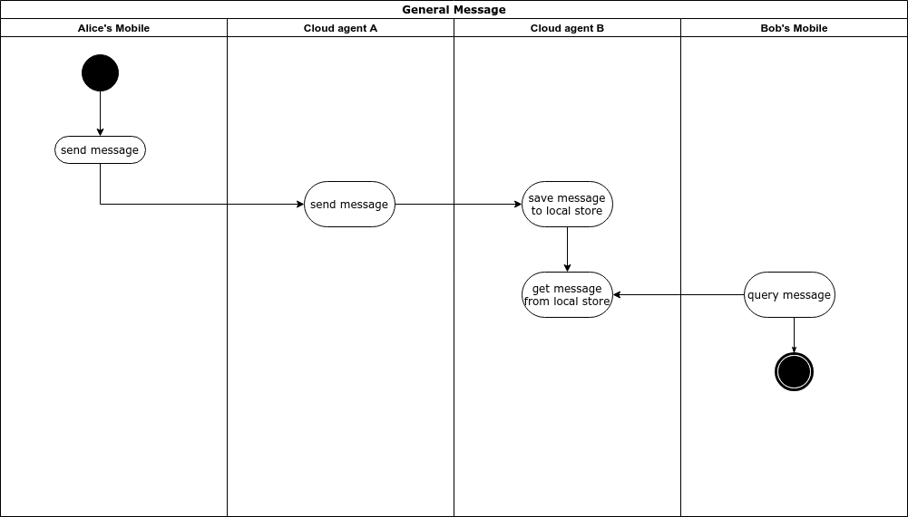
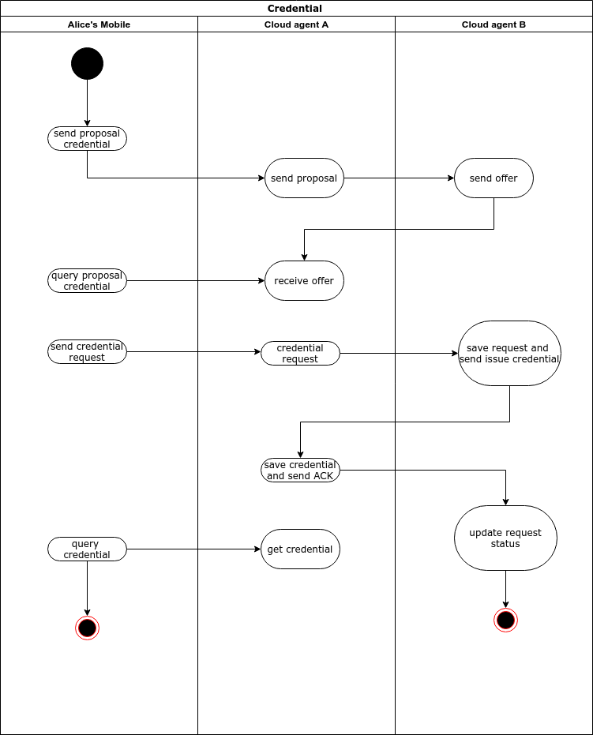

# Ontology DID Communication Framework

## 1. 背景

Ontology DID Communication Framework (ODCF) 是基于Ontology DID协议的点对点,去中心化可信的数字身份通信框架.


## 2. 代理(Agent)

DID通过agent实现相互的通信, agent的角色分为

1. User agent
2. Cloud agent
3. Service agent

### 2.1 User agent

User agent 为终端用户所控制, 用户自主掌握DID和对应的私钥,并可以本地保存证明等文件,包括移动端和其他富客户端等.


### 2.2 Cloud agent

由于user agent 不可能实时在线, 所以在通信过程中,需要cloud agent作为中继和转发, 并且缓存消息以便于user agent在上线时随时查询. Cloud agent 部署在云端, 可以提供稳定的链接和服务, cloud agent 本身有对外公开的DID和Service point, 所以需要妥善的保存好对应的私钥.


### 2.3 Service agent

Service agent 本身也是cloud agent, 同时也提供一些DID 凭据(如学校等第三方机构的文凭)的颁发等服务,  Service agent 应该具有公开的并经过认证的DID ,以供所有人使用,所以也需要对秘钥进行妥善的保管.


## 3.协议

ODCF定义了以下的通信协议

### 3.1 Connection 协议

DID间的通信首先要建立connection 的链接




建立connection的流程如下(Alice 和Bob可以共用同一个Cloud agent):




#### 3.1.1 Invitation

Alice 发布一个邀请信息并发送给Bob, Bob只有拿到这个invitation才能与Alice建立链接.

Alice 需要首先将Invitation 内容注册到自己的cloud agent中

请求的消息结构如下:

```json
{
    "@type": "spec/connections/1.0/invitation",
    "@id": "uuid-of-msg",
    "label": "Alice",
    "did": "did:ont:alicedid",
    "router":["did:ont:cloudAgent#serviceid"]
}
```

**type** : invitation 的固定标准类型.

**id**:本次Invitation的ID, 对于每个DID唯一.

**label**: invitation的标签

**did** : 邀请者的DID

**router** : 为邀请者cloud agent的DID和service id(在DID Doc中定义)

cloud agent的可能响应为:

```json
{
    "code": 0,
    "msg": "",
    "data": {
        "message_type": 0,
        "content": {
            "@type": "spec/connection/1.0/invitation",
            "@id": "A000000020",
            "label": "alice",
            "did": "did:ont:TQAiaefkdypSBiCSV9h9MfBJ2Ypy9fa7LY",
            "router": [
                "did:ont:TKgH6JiYWSLxWpCyoDZuky6rpNrG79zedz#1"
            ]
        }
    }
}
```


#### 3.1.2 Connection request

Bob 接收到 Alice的Invitation后,可以根据```router``` 中service ID取得 对方cloud agent的 service end point, (将来直接通过生成二维码进行扫描发送请求)

请求的消息结构体如下:

```json
{
  "@id": "uuid",
  "@type": "spec/connections/1.0/request",
  "label": "Bob",
  "connection": {
    "my_did": "did:ont:Bobdid",
    "my_router":["did:ont:cloudAgentA#id"]  ,
    "their_did":"did:ont:Alicedid",
     "their_router":["did:ont:cloudAgentB#id"]  ,
  },
  "invitation_id":"invitation_id",
}
```

**type**: connection request 的固定标准类型

**id**: 本次连接请求的id, 对于每个发起方的DID唯一

**label**: connection request 标签

**connection**: 

​	 **my_did**: 请求方的did

​	**my_router** :请求方的cloud agent did及service id

​	**their_did**: 目标方的did

​	**their_router**: 目标方的cloud agent did及service id

**invitation_id**: 为3.1.1 的Invitation id


#### 3.1.3 Connection response

Alice 的cloud agent接收到 Bob的连接请求后, 首先验证Invitation的状态和合法性, 然后向 Bob的cloud agent发送 connection response 消息:

```json
{
  "@type": "spec/connections/1.0/response",
  "@id": "uuid-of-msg",
  "~thread": {
    "thid": "<@id of request message>"
  },
  "connection": {
    "my_did": "did:ont:Alicedid",
    "my_router":["did:ont:cloudAgent#id"]  ,
    "their_did":"did:ont:Bobdid",
    "their_router":["did:ont:cloudAgent#id"]  ,
  }
}
```

**type**: connection response 的固定标准类型

**id**: 本次连接响应的id

**thread**: 关联的消息内容

​	**thid**: 对应的connection request的id

**connection**: 同3.1.1


#### 3.1.4 Connection ACK

Bob 的cloud agent接收到Alice的 响应后:

1. 更新本次连接请求的状态
2. 保存Bob -> Alice 的链接
3. 发送Connection ACK给Alice的cloud agent

connection ACK的消息:

```json
{
    "@type":"spec/connections/1.0/ack",
    "@id": "uuid-of-msg",
    "~thread": {
    	"thid": "<@id of request message>"
  	},
  	"status":"succeed",
    "connection": {
        "my_did": "did:ont:Bobdid",
        "my_router":["did:ont:cloudAgent#id"]  ,
        "their_did":"did:ont:Alicedid",
        "their_router":["did:ont:cloudAgent#id"]  ,
      }
  }
}
```

**type**: connection ACK 的固定标准类型

**id**: 本次连接响应的id

**status**:本次操作状态

**thread**: 关联的消息内容

​	**thid**: 对应的connection request的id

**connection**: 同3.1.1

Alice 接收到connection ACK后:

1. 更新本次Invitation的状态
2. 保存Alice -> Bob的链接


### 3.2 General Message 协议

在Alice 和Bob建立链接后, 可以相互发送通用的message




消息的结构如下:

```json
{
    "@type":"spec/basic-message/1.0/message"
    "@id": "<uuid-presentation>",
	"sent_time":timestamp,
	"content": string,
	"~I10n":{
        "local":"en"
	},
    "connection": {
        "my_did": "did:ont:Bobdid",
        "my_router":["did:ont:cloudAgent#id"]  ,
        "their_did":"did:ont:Alicedid",
        "their_router":["did:ont:cloudAgent#id"]  ,
      }
}
```

**type**: 通用消息 的固定标准类型

**id**: 本次连接响应的id

**send_time**: 发送的时间戳

**content**: 消息内容

**I10n**: 消息本地化信息

**connection**: 同3.1.1


### 3.3 Credential 协议

Alice可以请求某个机构的service agent为她颁发凭证, 在Alice 与这个service agent 建立链接以后,可以进行如下的流程:




#### 3.3.1 Proposal credential

用户可以向service agent 请求需要的凭证内容

请求消息:

```
{
    "@type": "spec/issue-credential/1.1/propose-credential",
    "@id": "<uuid-of-propose-message>",
    "comment": "some comment",
    "credential_proposal": {
        "@type":"spec/issue-credential/1.1/preview-credential",
        "attributes":[
            {
                "name":"xxx",
                "mime-type":"string",
                "value":"values"
            }
        ]
    },
    "connection": {
        "my_did": "did:ont:AliceDID",
        "my_router":["did:ont:cloudAgent#id"]  ,
        "their_did":"did:ont:serviceDID",
        "their_router":["did:ont:serviceDID#id"]  
      }
}
```


#### 3.3.2 Offer credential

Service agent 向请求方返回凭证的描述等信息

消息:

```
{
    "@type": "spec/issue-credential/1.1/propose-credential",
    "@id": "<uuid-of-propose-message>",
    "comment": "some comment",
    "credential_proposal": {
        "@type":"spec/issue-credential/1.1/preview-credential",
        "attributes":[
            {
                "name":"xxx",
                "mime-type":"string",
                "value":"values"
            }
        ]
    },
     "offers~attach": [
        {
            "@id": "attachment id",
            "description":"xxx",
            "mime-type": "application/json"
        }
    ],
    "connection": {
        "my_did": "did:ont:serviceDID",
        "my_router":["did:ont:serviceDID#id"]  ,
        "their_did":"did:ont:Alicedid",
        "their_router":["did:ont:cloudAgent#id"]  
      }
}
```

**type**: offer credential消息 的固定标准类型

**id**: 本次请求的**id**

**formats**: 标记attachment的结构信息

​	**attachid** :关联attach 的id

​	**format**: 关联attach的数据类型

**offers_attach**: 凭证的附件信息


#### 3.3.3 Request credential

Alice 通过agent向service agent发送凭证的请求

请求消息:

```
{
    "@type": "spec/issue-credential/1.0/request-credential",
    "@id": "<uuid-of-request-message>",
    "comment": "some comment",
    "formats":[
      {
          "attachid":"attachment id",
          "format":"string",
      }  
    ],
    "requests_attach":[
    	{
    		"@id":"1",
    		"data":{
    			"json":{"name":"age","value":"greater than 18"}
    		}
    	}	
    ]
    "connection": {
        "my_did": "did:ont:AliceDID",
        "my_router":["did:ont:cloudAgent#id"]  ,
        "their_did":"did:ont:serviceDID",
        "their_router":["did:ont:serviceDID#id"]  
      }
}
```

**type**: request credential消息 的固定标准类型

**id**: 本次请求的**id**

**formats**: 标记attachment的结构信息

​	**attachid** :关联attach 的id

​	**format**: 关联attach的数据类型


**requests_attach**: 凭证的附件信息


#### 3.3.4 Issue credential

Service agent 向请求方颁发凭证, cloud agent 将凭证保存在存储中,以便Alice查询

消息:

```
{
    "@type": "spec/issue-credential/1.0/issue-credential",
    "@id": "<uuid-of-issue-message>",
    "comment": "some comment",
    "formats":[
      {
          "attachid":"attachment id",
          "format":"string",
      }  
    ],
    "credentials~attach": [
        {
            "@id": "attachment id",
            "description":"xxx",
            "filename":"",
            "mime-type": "application/json",
            "lastmod_time":"timestamp",
            "byte_count":size,
            "data": {
            	"sha256":"",
            	"links":[],
                "base64": "<bytes for base64>",
                "json":{}
            }
        }
    ],
    "connection": {
        "my_did": "did:ont:serviceDID",
        "my_router":["did:ont:serviceDID#id"]  ,
        "their_did":"did:ont:AliceDID",
        "their_router":["did:ont:agentDID#id"]  
      },
  "~thread": {
    "thid": "<@id of request message>"
  },
}
```

**type**: issue credential消息 的固定标准类型

**id**: 本次请求的**id**

**formats**: 标记attachment的结构信息

​	**attachid** :关联attach 的id

​	**format**: 关联attach的数据类型


**requests_attach**: 凭证的附件信息

**thread** : thid 为request credential 的id


#### 3.3.5 Credential ACK

请求方向Service agent 发送ack响应

消息:

```
{
    "@type":"spec/credential/1.0/ack",
    "@id": "uuid-of-msg",
    "~thread": {
    	"thid": "<@id of request message>"
  	},
  	"status":"succeed",
    "connection": {
        "my_did": "did:ont:Alicedid",
        "my_router":["did:ont:cloudAgent#id"]  ,
        "their_did":"did:ont:serviceDID",
        "their_router":["did:ont:serviceDID#id"]  ,
      }
  }
}
```

**type**: issue credential消息 的固定标准类型

**id**: 本次请求的**id**

**status**: 本次操作状态

**thread** : thid 为request credential 的id

Service agent接收到ack之后,更新credential request的状态


### 3.4 Presentation


