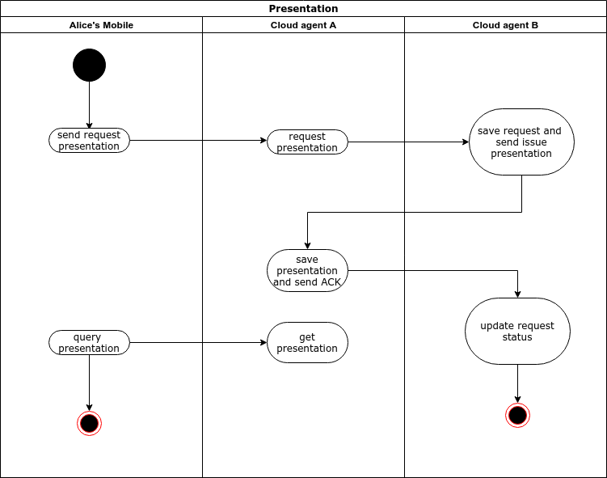

# Ontology DID Communication Framework Detail Design

## 1. Overview

Ontology DID Communication Framework is a trusted, decentralized peer to peer DID communication framework.


## 2. Agent

DIDs talk to each other through agents, there are three agent roles:

1. User agent.
2. Cloud agent.
3. Service agent.

### 2.1 User agent

User agent is controlled by end user, user can keep the DID corresponding secret key and store the verifiable credential in local storage. User agent can built as Mobile apps or other rich clients.


### 2.2 Cloud agent

User agents  can't be online for 24 * 7 , so in some business cases we need relay , forward and store credential using cloud agents. The cloud agent itself has a public DID and service end point, so the corresponding secret key needs to be properly kept.


### 2.3 Service agent

The service agent itself is also a cloud agent, and it also provides services such as the issuance of some verifiable credentials (such as diplomas from third-party institutions such as schools). The service agent should have a public and certified DID , so it also needs to Keep the secret key properly.


## 3. Protocols

The ontology DID communication framework defined following protocols:

### 3.1 Connection protocol

The communication between DIDs should establish connection first.


An example connection between Alice and Bob( they both use cloud agent for delegation)


#### 3.1.1 Invitation

Alice issued an invitation and send it to Bob, Bob can use this invitation to establish connection with Alice.

The request message could be:

```
{
    "@type": "spec/connections/1.0/invitation",
    "@id": "uuid-of-msg",
    "label": "Alice",
    "did": "did:ont:alicedid",
    "router":["did:ont:cloudAgent#serviceid"]
}
```

**type**: fixed for invitation.

**id**:UUID for the request message.

**label**: label for the request message.

**did**: DID for inviter

**router**: route path for inviter, format is DID + service end point id (defined in DID doc) 

Response example:

```
{
    "code": 0,
    "msg": "",
    "data": {
        "message_type": 0,
        "content": {
            "@type": "spec/connection/1.0/invitation",
            "@id": "A000000020",
            "label": "alice",
            "did": "did:ont:TQAiaefkdypSBiCSV9h9MfBJ2Ypy9fa7LY",
            "router": [
                "did:ont:TKgH6JiYWSLxWpCyoDZuky6rpNrG79zedz#1"
            ]
        }
    }
}
```

#### 3.1.2 Connection request

After Bob received Alice's invitation, he need to make connection request based on the invitation.

A request example:

```
{
  "@id": "uuid",
  "@type": "spec/connections/1.0/request",
  "label": "Bob",
  "connection": {
    "my_did": "did:ont:Bobdid",
    "my_router":["did:ont:cloudAgentA#id"]  ,
    "their_did":"did:ont:Alicedid",
     "their_router":["did:ont:cloudAgentB#id"]  ,
  },
  "invitation_id":"invitation_id",
}

```

**type**:fixed for connection request

**id**:UUID for the request message

**label**: label for the request message

**connection**: a common struct for describe connection info.

​	**my_did**: requester DID

​	**my_router**: requester router path, must have service endpoint id

​	**their_did**:target DID

​	**their_router**:target router path, must have service endpoint id

**invitation_id**: id in invitation 3.1.1


#### 3.1.3 Connection response

When Alice's cloud agent received Bob's connection request , the agent first validate the request, then send the response to Bob's cloud agent.

```
{
  "@type": "spec/connections/1.0/response",
  "@id": "uuid-of-msg",
  "~thread": {
    "thid": "<@id of request message>"
  },
  "connection": {
    "my_did": "did:ont:Alicedid",
    "my_router":["did:ont:cloudAgent#id"]  ,
    "their_did":"did:ont:Bobdid",
    "their_router":["did:ont:cloudAgent#id"]  ,
  }
}
```

**type**:fixed for connection response

**id**:UUID for the request message

**thread**: mark the corresponding message

​	**thid**: the id of connection request

**connection**: same with 3.1.2


#### 3.1.4 Connection ACK

After Bob's Cloud agent received connection response:

1. the agent update the request status.
2. save the Bob -> Alice connection in local storage.
3. send connection ACK to Alice's cloud agent.

```
{
    "@type":"spec/connections/1.0/ack",
    "@id": "uuid-of-msg",
    "~thread": {
    	"thid": "<@id of request message>"
  	},
  	"status":"succeed",
    "connection": {
        "my_did": "did:ont:Bobdid",
        "my_router":["did:ont:cloudAgent#id"]  ,
        "their_did":"did:ont:Alicedid",
        "their_router":["did:ont:cloudAgent#id"]  ,
      }
  }
}
```


**type**:fixed for connection ack

**id**:UUID for the request message

**thread**: mark the corresponding message

​	**thid**: the id of connection request

**connection**: same with 3.1.2 

**status**: status of connection.

When Alice's agent received the ACK:

1. the agent update the invitation status.
2. store the Alice -> Bob connection in local storage.


### 3.2 Basic Message Protocol

After connection established between Alice and Bob, they can send basic message (text message) to each other.


An Example of basic message:

```
{
    "@type":"spec/basic-message/1.0/message"
    "@id": "<uuid-presentation>",
	"sent_time":timestamp,
	"content": string,
	"~I10n":{
        "local":"en"
	},
    "connection": {
        "my_did": "did:ont:Bobdid",
        "my_router":["did:ont:cloudAgent#id"]  ,
        "their_did":"did:ont:Alicedid",
        "their_router":["did:ont:cloudAgent#id"]  ,
      }
}
```

**type**:fixed for basic message

**id**:UUID for the request message

**sent_time**: time stamp

**content**: text message

**I10n** : localization of the message content

**connection**: same with 3.1.2


### 3.3 Credential protocol

After connection established ,user can request a verifiable credential from some organization's service agent.(the cloud agent can be Alice herself)


#### 3.3.1 Proposal credential(Optional)

User can send a proposal to service agent.

```
{
    "@type": "spec/issue-credential/1.1/propose-credential",
    "@id": "<uuid-of-propose-message>",
    "comment": "some comment",
    "credential_proposal": {
        "@type":"spec/issue-credential/1.1/preview-credential",
        "attributes":[
            {
                "name":"name",
                "mime-type":"string",
                "value":"values"
            }
        ]
    },
    "connection": {
        "my_did": "did:ont:AliceDID",
        "my_router":["did:ont:cloudAgent#id"]  ,
        "their_did":"did:ont:serviceDID",
        "their_router":["did:ont:serviceDID#id"]  
      }
}
```

**credential_proposal**: content format need to follow service agent's instruction.

#### 3.3.2 Offer credential(Optional)

Service agent reply the proposal to user.

```
{
    "@type": "spec/issue-credential/1.1/propose-credential",
    "@id": "<uuid-of-propose-message>",
    "comment": "some comment",
    "credential_proposal": {
        "@type":"spec/issue-credential/1.1/preview-credential",
        "attributes":[
            {
                "name":"xxx",
                "mime-type":"string",
                "value":"values"
            }
        ]
    },
     "offers~attach": [
        {
            "@id": "attachment id",
            "description":"xxx",
            "mime-type": "application/json"
        }
    ],
    "connection": {
        "my_did": "did:ont:serviceDID",
        "my_router":["did:ont:serviceDID#id"]  ,
        "their_did":"did:ont:Alicedid",
        "their_router":["did:ont:cloudAgent#id"]  
      }
}
```


#### 3.3.3 Request credential

User can send request to the service agent through his cloud agent.

```
{
    "@type": "spec/issue-credential/1.0/request-credential",
    "@id": "<uuid-of-request-message>",
    "comment": "some comment",
    "formats":[
      {
          "attachid":"attachment id",
          "format":"string",
      }  
    ],
    "requests_attach":[
    	{
    		"@id":"1",
    		"data":{
    			"json":{"name":"age","value":"greater than 18"}
    		}
    	}	
    ]
    "connection": {
        "my_did": "did:ont:AliceDID",
        "my_router":["did:ont:cloudAgent#id"]  ,
        "their_did":"did:ont:serviceDID",
        "their_router":["did:ont:serviceDID#id"]  
      }
}
```

**type**:fixed for request message

**id**:UUID for the request message

**format**: description of the attach section.

**requests_attach**: the attach data.

**connection**: same as 3.1.1


#### 3.3.4 Issue credential

Service agent issue verifiable credential to user.

```
{
    "@type": "spec/issue-credential/1.0/issue-credential",
    "@id": "<uuid-of-issue-message>",
    "comment": "some comment",
    "formats":[
      {
          "attachid":"attachment id",
          "format":"string",
      }  
    ],
    "credentials~attach": [
        {
            "@id": "attachment id",
            "description":"xxx",
            "filename":"",
            "mime-type": "application/json",
            "lastmod_time":"timestamp",
            "byte_count":size,
            "data": {
            	"sha256":"",
            	"links":[],
                "base64": "<bytes for base64>",
                "json":{}
            }
        }
    ],
    "connection": {
        "my_did": "did:ont:serviceDID",
        "my_router":["did:ont:serviceDID#id"]  ,
        "their_did":"did:ont:AliceDID",
        "their_router":["did:ont:agentDID#id"]  
      },
  "~thread": {
    "thid": "<@id of request message>"
  },
}
```

**type**:fixed for issue credential

**id**:UUID for the request message

**format**: description of the attach section.

**credential_attach**: the attach data.

**connection**: same as 3.1.1

**thread**: thid is the id of request credential.


#### 3.3.5 Credential ACK

After receive the credential, user's agent will send the ACK to service agent.

```
{
    "@type":"spec/credential/1.0/ack",
    "@id": "uuid-of-msg",
    "~thread": {
    	"thid": "<@id of request message>"
  	},
  	"status":"succeed",
    "connection": {
        "my_did": "did:ont:Alicedid",
        "my_router":["did:ont:cloudAgent#id"]  ,
        "their_did":"did:ont:serviceDID",
        "their_router":["did:ont:serviceDID#id"]  ,
      }
  }
}
```

**type**:fixed for credential ack

**id**:UUID for the request message

**connection**: same as 3.1.1

**thread**: thid is the id of request credential.

**status**: credential status.


### 3.4 Presentation

User or organization can request presentation proof based on credential.

 

#### 3.4.1 Request Presentation

Request example:

```
{
	"@type":"spec/present-proof/1.0/request-presentation",
	"@id":"uuid-of-msg",
	"comment":"some comments",
    "connection": {
        "my_did": "did:ont:Alicedid",
        "my_router":["did:ont:cloudAgent#id"]  ,
        "their_did":"did:ont:serviceDID",
        "their_router":["did:ont:serviceDID#id"]  ,
      },
      "formats":[
    	{
    		"attach_id":"1",
    		"format":"base64"
    	}
    ],
    "request_presentation_attach":[
    	{
	    	"@id":"1",
	    	"data":{
	    		"base64":"base64 format of credential id"
	    	}
    	}
    ]
```

**type**:fixed for request presentation

**id**:UUID for the request message

**format**: description of the attach section.

**request_presentation_attach**: the attach data.

**connection**: same as 3.1.1


#### 3.4.2 Presentation

Service agent create and return the presentation proof.

```
{
    "@type": "spec/present-proof/1.0/presentation",
    "@id": "<uuid-presentation>",
    "comment": "some comment",
    "~thread": {
    	"thid": "<@id of request message>"
  	},
    "formats":[
      {
          "attachid":"attachment id",
          "format":"string",
      }  
    ],
    "presentations~attach": [
        {
            "@id": "attachment id",
            "mime-type": "application/json",
            "data": {
                "base64": "<bytes for base64>",
                "json":{}
            }
        }
    ],
     "connection": {
        "my_did": "did:ont:serviceDID",
        "my_router":["did:ont:serviceDID#id"]  ,
        "their_did":"did:ont:alicedid",
        "their_router":["did:ont:cloudagent#id"]  ,
      }
}
```

**type**:fixed for  presentation

**id**:UUID for the request message

**format**: description of the attach section.

**presentation_attach**: the attach data.

**connection**: same as 3.1.1


#### 3.4.3 Presentation ACK

User will send the ACK after received the presentation from service agent.

```
{
    "@type":"spec/presentation/1.0/ack",
    "@id": "uuid-of-msg",
    "~thread": {
    	"thid": "<@id of request message>"
  	},
  	"status":"succeed",
    "connection": {
        "my_did": "did:ont:Alicedid",
        "my_router":["did:ont:cloudAgent#id"]  ,
        "their_did":"did:ont:serviceDID",
        "their_router":["did:ont:serviceDID#id"]  ,
      }
  }
}
```

**type**:fixed for presentation ack

**id**:UUID for the request message

**connection**: same as 3.1.1

**thread**: thid is the id of request presentation.

**status**: presentation status.


## 4. Envelop and Encrypt

Please refer to [Envelop and Encrypt](https://git.ont.io/ontid/otf/src/master/doc/Envelop%20and%20Encrypt%20Message_en.md)