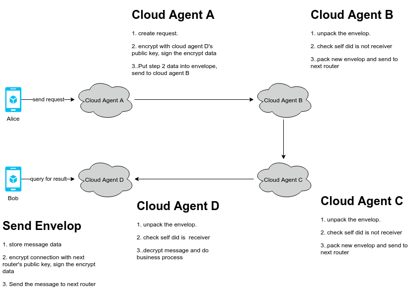

# Forward and Encrypt message

## 1. 背景

通常 agent 直接无法直接通信,需要通过中继和转发才能将消息传递到目标 agent, 在传递过程中,原数据不能泄露给中继agent.




## 2. 设计方案

agent直接的消息格式定义为 Envelope:

```json
{
    "message":{
        "data":"encrypt the message data",
        "msgtype": type of message(int),
        "sign":"signature of data"
    },
    "connection":{
        "data":"encrypt connection data",
        "sign":"signature of data"
    },
    "fromdid":"sender did",
    "todid":"receiver did"
}
```

connection的格式为:

```json
{
    "my_did": "did:ont:alice",
    "my_router":["did:ont:cloudA#serviceid","did:ont:cloundB#serviceid"],
    "their_did": "did:ont:Bob",
    "their_router":["did:ont:cloudD#serviceid","did:ont:cloudC#serviceid"]
}
```

说明:

1. my_router 和 their_router必须非空, my_router的第一个元素为代理节点,其他为转发节点, their_router 的第一个元素为接收节点,其他为转发节点
2. my_did和代理节点可以是同一个, their_did和接收节点可以是同一个.
3. 发送代理节点使用接收节点的公钥加密请求数据,并使用自己的私钥进行签名
4. 发送节点使用next router的公钥加密 connection数据,并使用自己的私钥进行签名
5. 发送节点将envelope 发送给next router.
6. 转发节点接收消息后,首先验证并解密connection数据, 如果自己不是接收节点,则用下一个节点的公钥加密connection数据,发送envelope到下一个节点.
7. 如果自己是接收节点,则使用自己的私钥验证并解密message数据,进行相应的业务处理.


