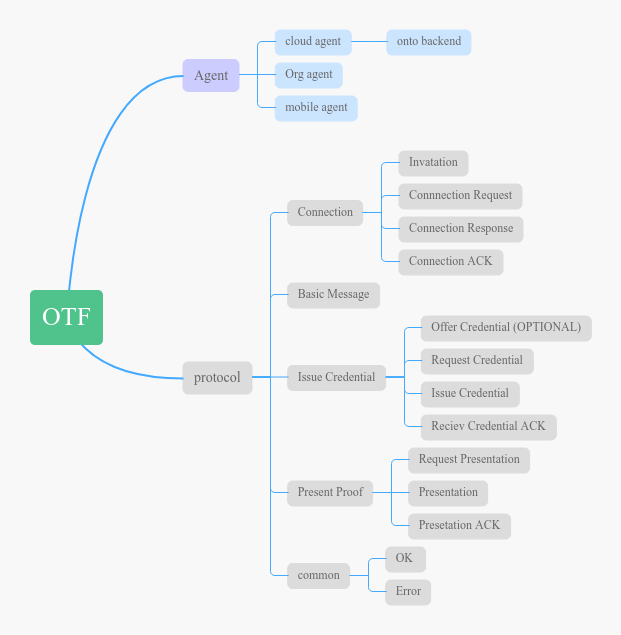
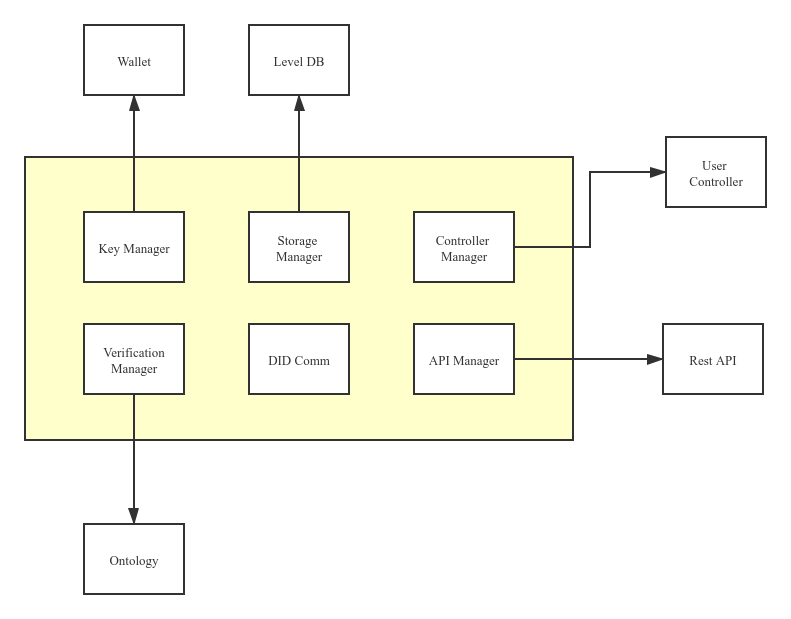
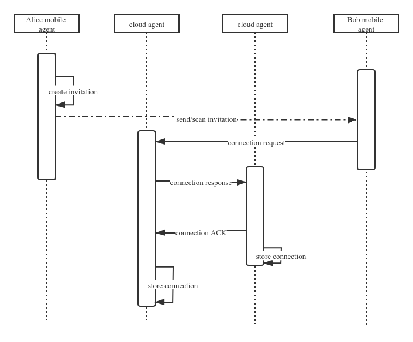
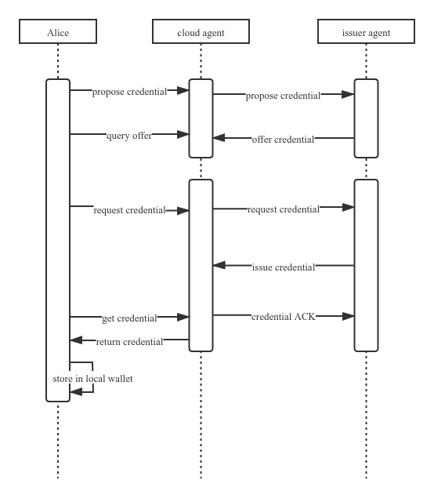
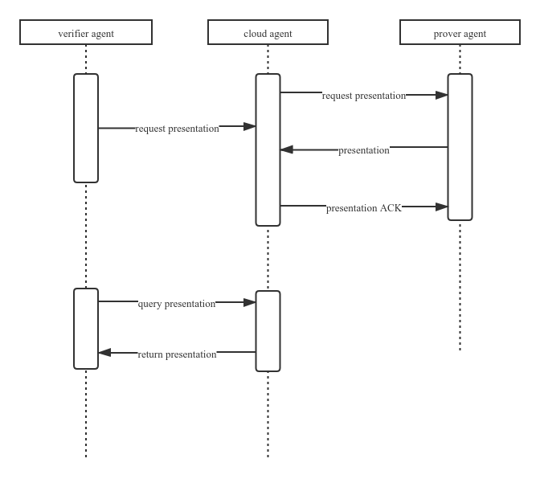

# ONTID Transport Framework Design

## 1. Introduction

TO BE ADDED


## 2. Structure






## 3. Protocols

We will use following protocols like  [Aries](https://github.com/hyperledger/aries-rfcs/blob/master/features/0160-connection-protocol/README.md)

### 3.1 Connection protocols:

Sequence:




#### 3.1.1 Invitation

An invitation is for other agent to connect 

Message sample

```json
{
    "@type": "spec/connections/1.0/invitation",
    "@id": "uuid-of-msg",
    "label": "Alice",
    "did": "did:ont:alicedid",
    "router":["did:ont:cloudAgent#serviceid"]
}
```

**type** : message type

**id**: message uuid

**label**:invitation label

**did**: inviter's did

**service_id**:service id in didDoc

TBD: routingkey ??


#### 3.1.2 Connection Request

The invitee send connection based on the invitation

Message sample

```json
{
  "@id": "uuid",
  "@type": "spec/connections/1.0/request",
  "label": "Bob",
  "connection": {
    "my_did": "did:ont:Bobdid",
    "my_router":["did:ont:cloudAgent#id"]  ,
    "their_did":"did:ont:Alicedid",
     "their_router":["did:ont:cloudAgent#id"]  ,
  },
  "invitation_id":"invitation_id",
}
```

**id**:message uuid

**type** : message type

**label**:connection label

**connection**:

​	**DID**: self did

​	**service_id**:service id in didDoc

#### 3.1.3 Connection Response

Message sample

```
{
  "@type": "spec/connections/1.0/response",
  "@id": "uuid-of-msg",
  "~thread": {
    "thid": "<@id of request message>"
  },
  "connection": {
    "my_did": "did:ont:Bobdid",
    "my_router":["did:ont:cloudAgent"]  ,
  	"my_service_id":"BobServiceID",
    "their_did":"did:ont:Alicedid",
    "their_router":["did:ont:cloudAgent"]  ,
    "their_service_id":"AliceServiceID" 
  }
}
```


#### 3.1.4  Acknowledgement

```
{
    "@type":"spec/connections/1.0/ack",
    "@id": "uuid-of-msg",
    "~thread": {
    	"thid": "<@id of request message>"
  	},
  	"status":"succeed",
  	"connection": {
        "my_did": "did:ont:Bobdid",
        "my_router":["did:ont:cloudAgent"]  ,
        "my_service_id":"BobServiceID",
        "their_did":"did:ont:Alicedid",
        "their_router":["did:ont:cloudAgent"]  ,
        "their_service_id":"AliceServiceID" 
      }
  }
}
```


### 3.2 Issue Credential Protocol

sequence:



#### 3.2.1 Proposal credential(optional)

potential Holder to Issuer (optional). Tells what the Holder hopes to receive.

Schema:

```json
{
    "@type": "spec/issue-credential/1.1/propose-credential",
    "@id": "<uuid-of-propose-message>",
    "comment": "some comment",
    "credential_proposal": {
        "@type":"spec/issue-credential/1.1/preview-credential",
        "attributes":[
            {
                "name":"xxx",
                "mime-type":"string",
                "value":"values"
            }
        ]
    },
    "connection": {
        "my_did": "did:ont:Bobdid",
        "my_router":["did:ont:cloudAgent"]  ,
        "my_service_id":"BobServiceID",
        "their_did":"did:ont:Alicedid",
        "their_router":["did:ont:cloudAgent"]  ,
        "their_service_id":"AliceServiceID" 
      }
}
```


#### 3.2.2 Offer credential

Issuer to potential Holder (optional for some credential implementations; Tells what the Issuer intends to issue, and possibly, the price the Issuer expects to be paid.

Schema:

```
{
    "@type": "spec/issue-credential/1.1/propose-credential",
    "@id": "<uuid-of-propose-message>",
    "comment": "some comment",
    "credential_proposal": {
        "@type":"spec/issue-credential/1.1/preview-credential",
        "attributes":[
            {
                "name":"xxx",
                "mime-type":"string",
                "value":"values"
            }
        ]
    },
     "offers~attach": [
        {
            "@id": "attachment id",
            "description":"xxx",
            "mime-type": "application/json"
        }
    ],
    "connection": {
        "my_did": "did:ont:Bobdid",
        "my_router":["did:ont:cloudAgent"]  ,
        "my_service_id":"BobServiceID",
        "their_did":"did:ont:Alicedid",
        "their_router":["did:ont:cloudAgent"]  ,
        "their_service_id":"AliceServiceID" 
      }
}
```

#### 3.2.3 Request credential

potential Holder to Issuer. If neither of the previous message types is used, this is the message that begins the protocol.

Schema:

```
{
    "@type": "did:ont:agentdid;spec/issue-credential/1.0/request-credential",
    "@id": "<uuid-of-request-message>",
    "comment": "some comment",
    "formats":[
      {
          "attachid":"attachment id",
          "format":"string",
      }  
    ],
    "requests~attach": [
        {
            "@id": "offer attachment id",
        }
    ],
    "connection": {
        "my_did": "did:ont:Bobdid",
        "my_router":["did:ont:cloudAgent"]  ,
        "my_service_id":"BobServiceID",
        "their_did":"did:ont:Alicedid",
        "their_router":["did:ont:cloudAgent"]  ,
        "their_service_id":"AliceServiceID" 
      }
}
```

**formats**:Formats contains an entry for each requests~attach array entry, providing the the value of the attachment @id and the verifiable credential format and version of the attachment.

**requests~attach**: RequestsAttach is a slice of attachments defining the requested formats for the credential, optional

#### 3.2.4 Issue credential

Issuer to new Holder. Attachment payload contains the actual credential.

Schema:

```
{
    "@type": "spec/issue-credential/1.0/issue-credential",
    "@id": "<uuid-of-issue-message>",
    "comment": "some comment",
    "formats":[
      {
          "attachid":"attachment id",
          "format":"string",
      }  
    ],
    "credentials~attach": [
        {
            "@id": "attachment id",
            "description":"xxx",
            "filename":"",
            "mime-type": "application/json",
            "lastmod_time":"timestamp",
            "byte_count":size,
            "data": {
            	"sha256":"",
            	"links":[],
                "base64": "<bytes for base64>",
                "json":{}
            }
        }
    ],
    "connection": {
        "my_did": "did:ont:Bobdid",
        "my_router":["did:ont:cloudAgent"]  ,
        "my_service_id":"BobServiceID",
        "their_did":"did:ont:Alicedid",
         "their_router":["did:ont:cloudAgent"]  ,
        "their_service_id":"AliceServiceID" 
      },
  "~thread": {
    "thid": "<@id of request message>"
  },
}
```

`credentials~attach` -- an array of attachments containing the issued credentials.


#### 3.2.5 Credential ACK

Same with 3.1.4


### 3.3 Present Proof Protocol

sequence:




#### 3.3.1 Request Presentation 

From a verifier to a prover, the `request-presentation` message describes values that need to be revealed and predicates that need to be fulfilled. Schema:

```
{
    "@type": "spec/present-proof/1.0/request-presentation",
    "@id": "<uuid-request>",
    "comment": "some comment",
    "formats":[
      {
          "attachid":"attachment id",
          "format":"string",
      }  
    ],
    "request_presentations~attach": [
        {
            "@id": "attachment id"
        }
    ],
    "connection": {
        "my_did": "did:ont:Bobdid",
         "my_router":["did:ont:cloudAgent"]  ,
        "my_service_id":"BobServiceID",
        "their_did":"did:ont:Alicedid",
         "their_router":["did:ont:cloudAgent"]  ,
        "their_service_id":"AliceServiceID" 
      }
}
```

#### 3.3.2 Presentation

This message is a response to a Presentation Request message and contains signed presentations. Schema:

```
{
    "@type": "spec/present-proof/1.0/presentation",
    "@id": "<uuid-presentation>",
    "comment": "some comment",
    "formats":[
      {
          "attachid":"attachment id",
          "format":"string",
      }  
    ],
    "presentations~attach": [
        {
            "@id": "attachment id",
            "mime-type": "application/json",
            "data": {
                "base64": "<bytes for base64>",
                "json":{}
            }
        }
    ],
    "connection": {
        "my_did": "did:ont:Bobdid",
         "my_router":["did:ont:cloudAgent"]  ,
        "my_service_id":"BobServiceID",
        "their_did":"did:ont:Alicedid",
         "their_router":["did:ont:cloudAgent"]  ,
        "their_service_id":"AliceServiceID" 
      }
}
```

#### 3.3.3 Presentation ACK

Same with 3.1.4


### 3.4 Basic message

Message is message model for basic message protocol

```json
{
    "@type":"spec/basic-message/1.0/message"
    "@id": "<uuid-presentation>",
	"sent_time":timestamp,
	"content": string,
	"~I10n":{
        "local":"en"
	},
	"connection": {
        "my_did": "did:ont:Bobdid",
         "my_router":["did:ont:cloudAgent"]  ,
        "my_service_id":"BobServiceID",
        "their_did":"did:ont:Alicedid",
         "their_router":["did:ont:cloudAgent"]  ,
        "their_service_id":"AliceServiceID" 
      }
}
```


## 4. Envelop and Encrypt

### 4.1 Envelope

Messages transport between agents should packed as an envelope.

Envelope struct:

```
{
    "message":{
        "data":"encrypt data as hex format",
        "sign":"data signature by sender did",
        "msgtype":int,
    },
    "fromdid":"sender did",
    "todid":"receiver did"
}
```

Before outbound message sent, 

1.  Encrypt message by receiver did binded public key.
2. Sign the encrypt data using sender's did binded private key.
3. Set the pre-defined message type .
4. Set self did as ```fromdid```
5. Set receiver did as ```todid```
6. Post the message to receiver did binded service point.

### 4.2 Encrypt

currently use ontology-crypto lib.